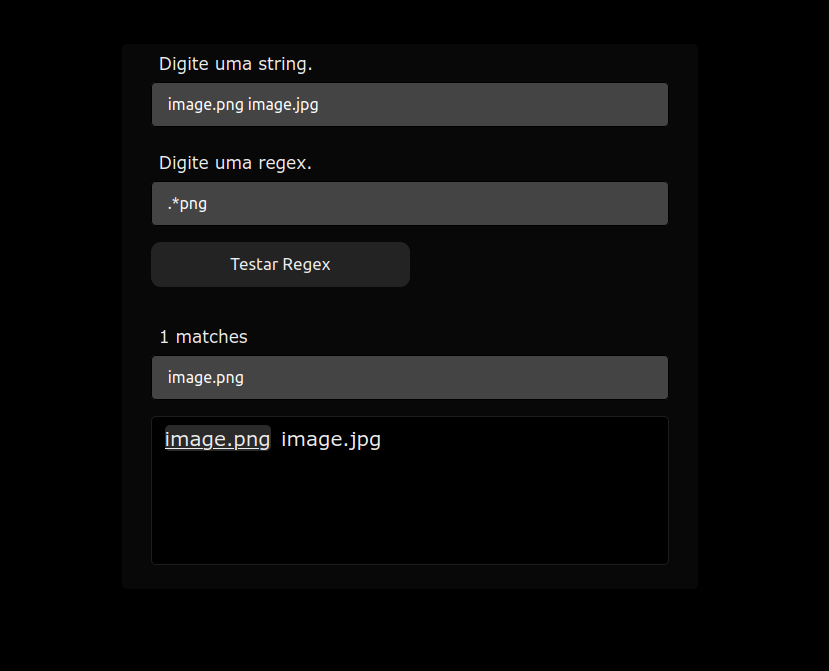

<div align="left">
  <h1 align="center">Simple JavaScript regex tester</h1>
    
</div>

## Getting Started

1. Clone the repo
   ```sh
   git clone https://github.com/Rafaelb4rros/Regex-tester.git
   ```
2. Set up index.html
